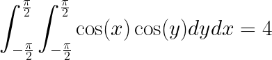

# Double Integral

This is a code example of how one can do a double integral.

This example code computes the following definate integral :



using the SA::RK2Integrator, with dx = dy = 0.01

```
$ make
$ ./DoubleIntegral
Volume = 3.99989.
```


