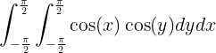

# Double Integral

This is a code example of how one can compute a double integral.

This example code computes the following definate integral :



using the SA::RK4Integrator.

The correct answer is 4.

```
$ make
$ ./DoubleIntegral
Volume = 3.99989.
```


