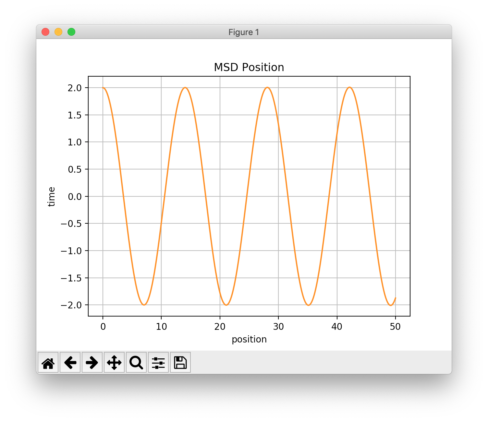

## MassSpringDamper

The MassSpringDamper program uses the SA::EulerCromerIntegrator class to
simulate a forced mass-spring-damper system.

The mass is chosen to be 1 kg. The damping constant is chosen to be 5 Ns/m.
The spring constant is calculated for a frequency of 2 hz. Every 5 seconds,
the system is given an impulse of 500 Newtons for 0.005 seconds.

For each numerical integration time-step, the simulation program prints

1. time (s)
2. position (m)
3. velocity (m/s)

to ```stdout```, in Comma Separated Values (CSV) format.

### Building & Running the Simulation Program
To compile MassSpringDamper:

```
$ make
```
To run it, and generate a CSV file:

```
$ ./MassSpringDamper > msd.csv
```

### Plotting the Results
The Python script, ```plot_position.py``` is provided to plot the results in ```msd.csv``` using (Python) matplotlib.

Plot position vs. time as follows:

```
$ python plot_position.py
```



### References:
[https://en.wikipedia.org/wiki/Mass-spring-damper_model](https://en.wikipedia.org/wiki/Mass-spring-damper_model)
