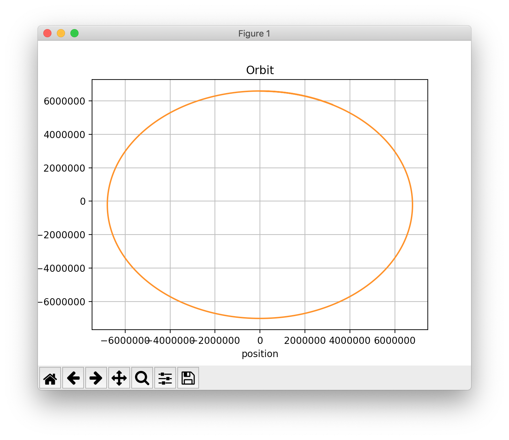

# Orbit

The Orbit program uses the *SA::EulerCromerIntegrator* class to simulate
the orbit of a satellite around the Earth.

The altitude of the satellite is chosen to be 408000.0 meters, the
approximate altitude of the International Space Station. The initial
position, and velocity of the satellite is calculated to maintain a
circular orbit around the Earth. The orbital period is also calculated,
to determine how long the simulation should run to complete a full orbit.

For each numerical integration time-step, the simulation program prints:

1. time (s)
2. 2D position vector (m)
3. 2D velocity vector (m/s)

to ```stdout```, in Comma Separated Values (CSV) format.

### Building & Running the Simulation Program

Generate the results as follows:

```
$ make
$ ./Orbit > orbit.csv
```
### Plotting the Results
The Python script, ```plot_position.py``` is provided to plot the results
in ```orbit.csv``` using (Python) matplotlib.

Plot position vector for the orbit duration as follows:

```
$ python plot_position.py
```



### References:
[https://en.wikipedia.org/wiki/Circular_orbit](https://en.wikipedia.org/wiki/Circular_orbit)
